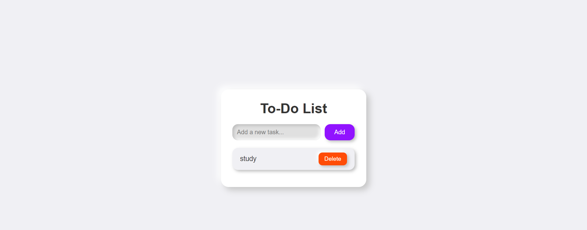

# To-Do List App

This is a simple To-Do List web app built using HTML, CSS, and JavaScript, with a stylish **claymorphism** design. Users can add and remove tasks, with the list dynamically updated in real-time.

## Features

- Add new tasks to the to-do list.
- Delete tasks from the to-do list.
- Minimalist, responsive, and visually appealing claymorphism theme.
- Hover effects and soft 3D-like shadows.
  
## Technologies Used

- **HTML**: Structure of the web app.
- **CSS**: Styling and layout, with claymorphism effects for a modern look.
- **JavaScript**: Logic for adding and removing tasks dynamically.

## Preview

 

## Setup Instructions

1. **Download/Clone the Repository**
   - Clone the project using Git or download the project files.
   ```bash
   git clone https://github.com/your-username/TO-DO-LIST.git
   ```

2. **Open the Project**
   - Navigate to the project directory and open `index.html` in your browser.
   ```bash
   cd TO-DO-LIST
   ```

3. **Enjoy the To-Do List App**
   - The app should load in your browser, allowing you to start adding tasks right away.

## Project Structure

```
📁 TO-DO-LIST
│
├── 📄 index.html         # HTML file for the app structure
├── 📄 style.css          # CSS file for claymorphism-themed styling
├── 📄 script.js          # JavaScript file for to-do list functionality
└── 📄 README.md          # Project overview and instructions
```

## How It Works

- Enter a task in the input field and click the "Add" button or press **Enter** to add the task to the list.
- Tasks will appear as list items below, each with a "Delete" button to remove them.
- The app uses JavaScript to dynamically manage the task list.

  ## Future Enhancements

- **Task completion**: Mark tasks as completed and allow users to strike-through tasks.
- **Persistent storage**: Use localStorage to save tasks even after closing the browser.
- **Task editing**: Add the ability to edit tasks in the list.

## License

This project is open source and available under the [MIT License](LICENSE).

